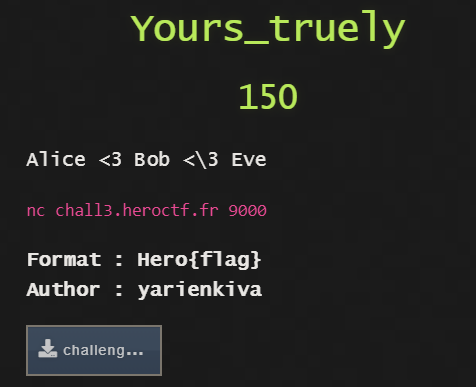

## Yours_truely - CRYPTO



On connecting to the server it will give you public modulus (n) and exponent (e).

You have to give a number (cmd) which when calculated like ```(cmd ^ e) mod n```
will be the same has the decimal form of ```sha512 hash of "the_proof_of_your_love"```

This is analogous to the condition where we know ciphertext, n and e.
Use this property: ```(c ^ (e*d)) mod n = c```

let ```X = long_to_bytes(hashlib.sha512(b'the_proof_of_your_love').digest())```
then the needed ```cmd = pow(X, d, n)```

To find ```d``` we must know ```p and q```. Easy! because p and q are close to each other
since q is the 10th next prime number after p. So use fermat's factoring algorithm to factor n.

Now that p and q are known, calculate d like ```d = pow(e, -1, phi) where phi = (p-1)*(q-1)```

(I did the factoring and calculating cmd part on [sagecell](https://sagecell.sagemath.org))

Pass the correct cmd and get the AES-CBC encrypted ciphertext.

The AES encryption key is just a hoax since
```python
key = hashlib.sha256().update(b"anything")
key = pad(str(key).encode, 16)
key == b'None\x0c\x0c\x0c\x0c\x0c\x0c\x0c\x0c\x0c\x0c\x0c\x0c' # LOL indeed
```

similarly the IV is also an 87.5% hoax
```long_to_bytes(int(time.time()))``` is just 4 bytes and that too with the first two bytes being
constant (for at least the CTF duration)

```iv = b'`\x85' + <two unknown bytes> + b'\x0c\x0c\x0c\x0c\x0c\x0c\x0c\x0c\x0c\x0c\x0c\x0c'```

bruteforcing for these two bytes is just a matter of seconds.

Flag: ```Hero{P4ul_Eluh4ck}```
