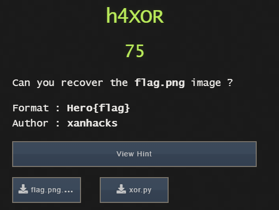

### h4XOR - CRYPTO

The image was encrypted blockwise by XORING each 9 byte block with a random XOR key

The XOR key's last two bytes lie between 0-9 each.

The thing about PNG files is that they all have their first 8 bytes (magic bytes) common.

So you got the first 8 bytes of the XOR-key and bruteforce for the last one.

