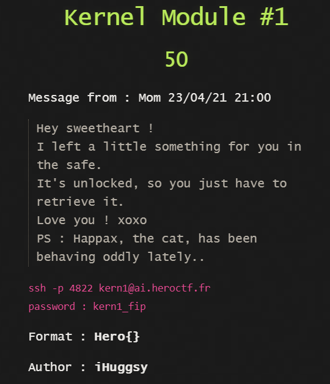

## Kernel Module #1 - KERNEL



Initiate the qemu emulator and analyze the file ```/dev/safe```

It is a character device so try to read data from it.
```bash
cat /dev/safe
```

Gives some weird MEOW MEOW text.

Tried with some other file reading utility and got the flag
```
head /dev/safe
base64 /dev/safe | base64 -d
```

Flag: ```Hero{s0_yOu_C4n_r34d_Fr0m_cHrD3v}```

The reason this happened is because a custom binary was being used for ```cat```
