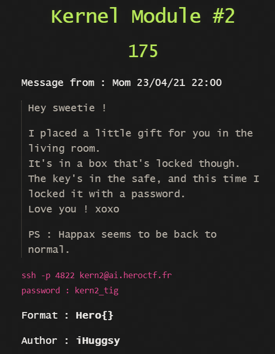
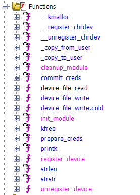
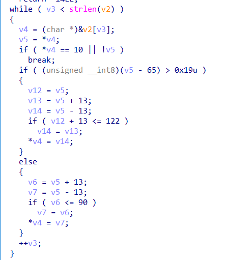
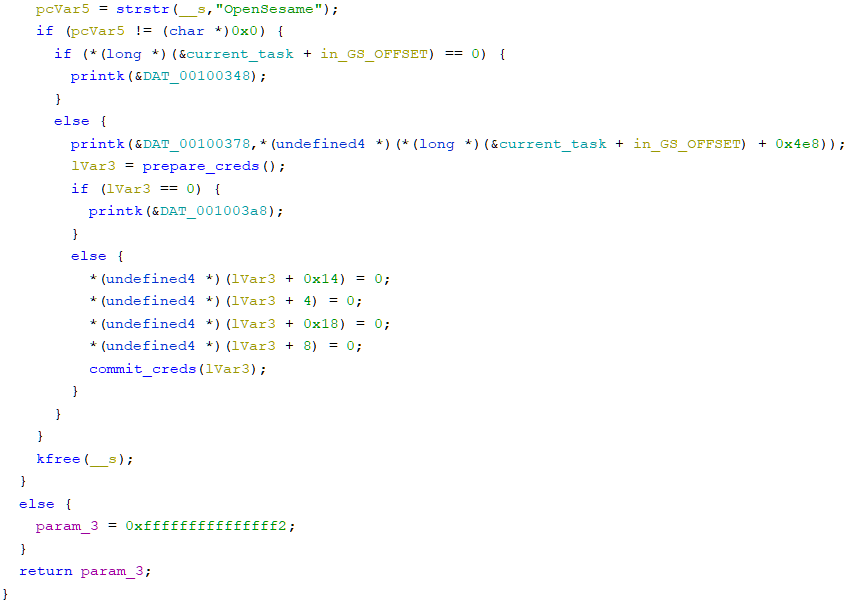

## Kernel Module #2 - KERNEL



After starting the qemu emulator I found two files ```flag.txt and safe_mod.ko```
```flag.txt``` is only readable by the root user and ```safe_mod.ko``` is an LKM so analyze it in a decompiler.



When the LKM loads it executes ```init_module``` function which registers
the ```/dev/safe``` character device.

When unloaded, ```cleanup_module``` is executed which unregisters the device.

The I/O of the character device is controlled by this LKM though
```device_file_read and device_file_write``` functions.

These functions make use of Kernel APIs, namely ```copy_to_user and copy_from_user``` respectively
Their purpose is I/O of data between the user-space and kernel-space.

Our interest is in ```device_file_write``` since it reads the data we write to ```/dev/safe```



The input string is processed by this algorithm which is a simple ROT-13.



Finally, it is compared to ```"OpenSesame"```. So write the [ROT-13](https://www.dcode.fr/rot-13-cipher) of ```"OpenSesame"``` to ```/dev/safe```

```echo BcraFrfnzr > /dev/safe```

Now, magic happens! Doing this escalated our privilege to root. Cat the Flag!

```
cat flag.txt
Hero{y0u_c4n_4ls0_Wr1t3_?!!}
```
