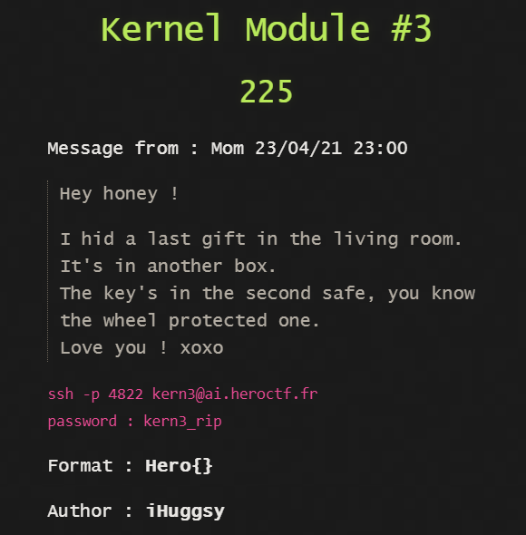
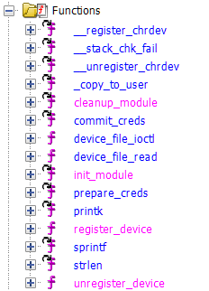
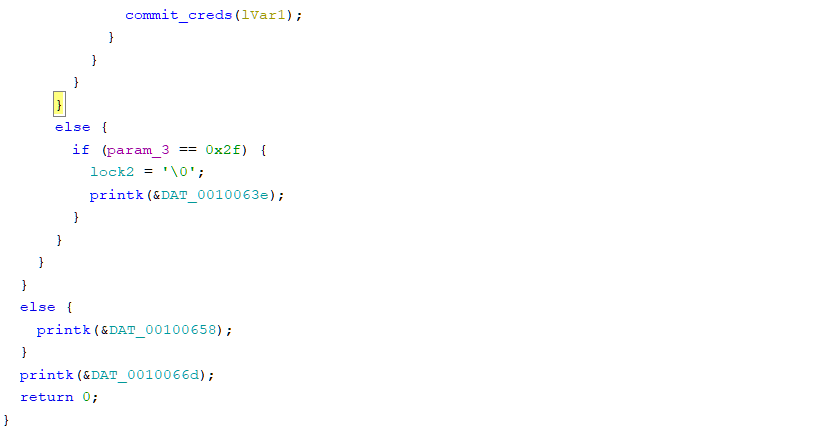

## Kenel Module #3 - KERNEL



The setup is the same as Kernel Module #2 with ```flag.txt and safe_mod.ko```
Decompile ```safe_mod.ko```

```cat /dev/safe``` says that the safe is protected by three locks and all three are locked initially.



This time we have ```device_file_ioctl``` instead of ```device_file_read```




Hence the unlock combination is ```69 47 20``` 

```device_file_ioctl``` is not using the ```copy_from_user``` Kernel API so we can't write data to the device simply by
```echo data > /dev/safe```

Instead we have to call the ```ioctl``` function and pass the unlock codes as parameters to it.

Challenge hint mentions an ioctl macro
```c
#define W_COMBINATION _IOW('x', 'w', int*)
```

This defines ```W_COMBINATION``` as an ioctl write command where ```'x' and 'w'``` are author arguments (don't actually matter, can be anything) and ```int*``` is the type associated with the command.

Syntax: ```ioctl(file_descriptor, W_COMBINATION, unlock_code)```

Call this function three times to unlock all three locks and it will again escalate your privilege to root.

But the privilege is granted to the C-application so execute a shell within the application
```c
system("/bin/sh");
```

Cat the Flag!
```
cat flag.txt
Hero{y0u_4re_Da_cHrD3V_M4sT3R}
```
