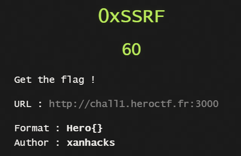
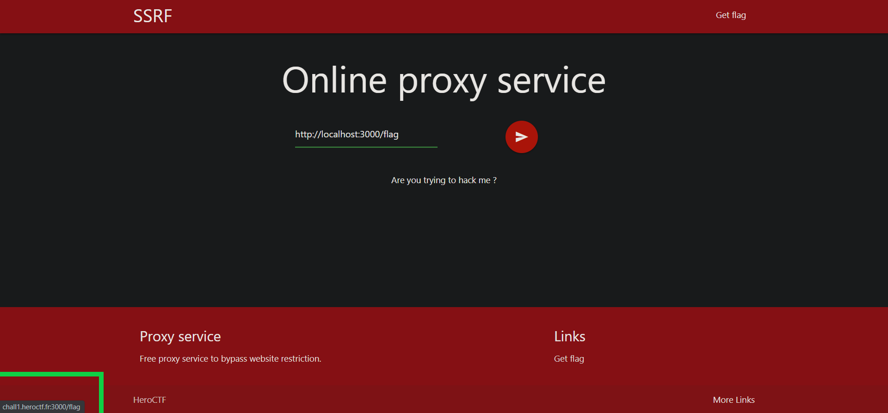
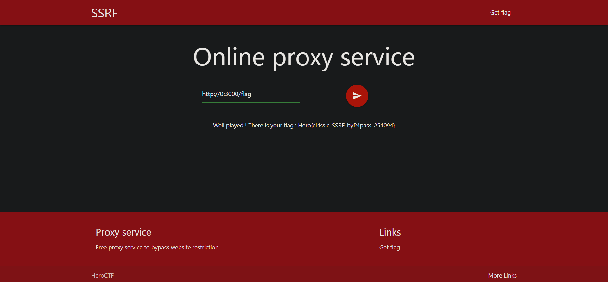

## 0xSSRF - WEB



Clearly the name refers to Server Side Request Forgery

Clicking on ```Get flag``` won't give you the flag but tell you that your IP address
isn't 127.0.0.1. Well it isn't.

So make a request to the flag endpoint using the provided proxy service itself



Nope! Tried some common SSRF payloads and this one worked.


