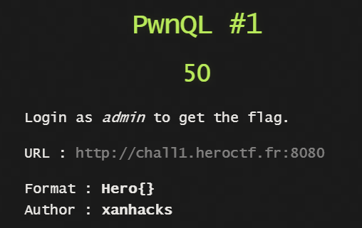
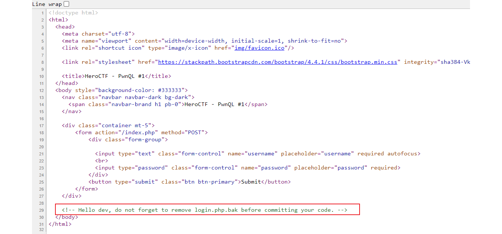
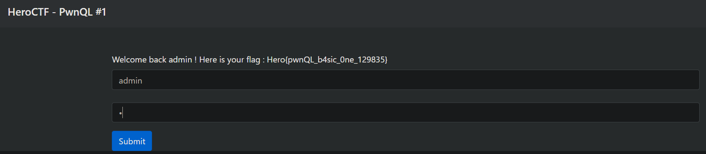

### PwnQL #1 - WEB



Look at the page source



Download the file at ```http://chall1.heroctf.fr:8080/login.php.bak```

The SQL query for authentication is
```php
$sql = "SELECT * FROM users WHERE username = :username AND password LIKE :password;";
```

Password is being matched for pattern. ```% and _``` are wildcards for the SQL LIKE operator.
```%``` matches any string of length >= 0
```_``` matches any character

So input the username and password as ```admin & %```


