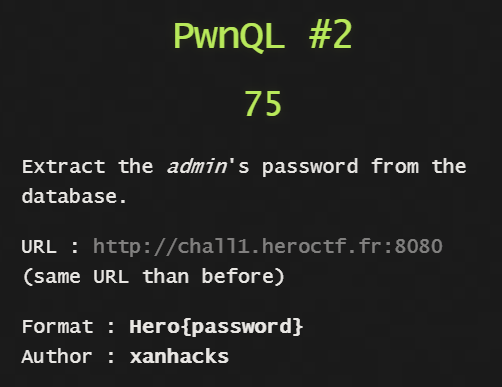

## PwnQL #2 - WEB



Already got ```login.php``` from PwnQL #1

Just check for the length of admin password by passing strings containing only ```_```
Got a hit at 10!

Now run the [exploit](exploit.py)
